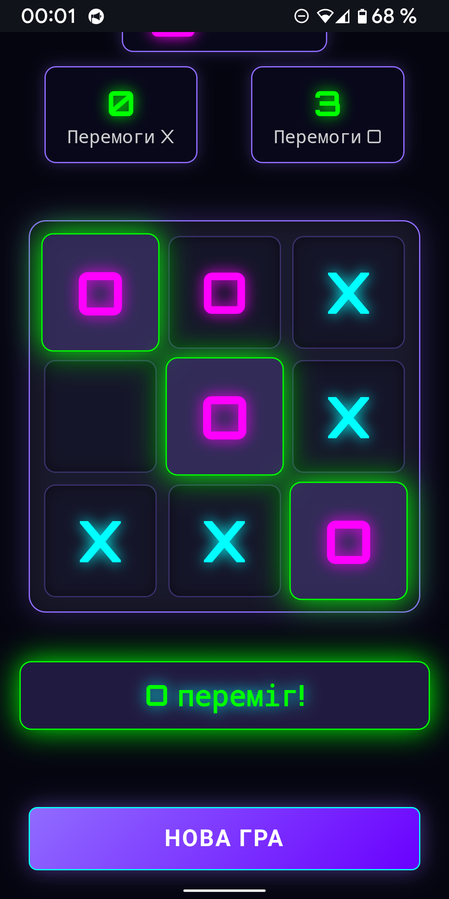

# ⚡ Cyberpunk Tic-Tac-Toe / Кіберпанк Хрестики-Ноліки 💾

[](LICENSE)
[](https://github.com/dneese/cyberpunk-tic-tac-toe/stargazers)
[](https://github.com/dneese/cyberpunk-tic-tac-toe/network)

> **Класична гра у футуристичному кіберпанк стилі. Занурся у Нео-Токіо, не виходячи з браузера.**

---

## 📸 Скріншот



---

## ✨ Основні Особливості

Ця версія Хрестиків-Ноликів створена з акцентом на продуктивність та атмосферу:

* **🎨 Атмосферний Дизайн:** Справжній кіберпанк-стиль з неоновими кольорами, глітч-ефектами та анімаціями.
* **🧠 Розумний AI:** Три рівні складності — від випадкових ходів до майже ідеальної гри (реалізовано за допомогою алгоритму **Мінімакс**).
* **👥 Режим для Двох Гравців:** Можливість гри з другом на одному пристрої.
* **🔊 Аудіо Супровід:** Електронні звукові ефекти, створені за допомогою **Web Audio API**.
* **📱 Повна Адаптивність:** Оптимізовано для роботи на всіх мобільних та десктопних пристроях.
* **🚀 Чистий JavaScript:** Висока швидкість роботи без залежностей від зовнішніх фреймворків чи бібліотек.

---

## 🕹️ Як Грати

1.  **Оберіть Режим:**
    * Гра проти AI.
    * Два гравці на одному пристрої.
2.  **Виберіть Складність AI (якщо граєте проти нього):**
    * **🟢 Легко:** AI робить випадкові ходи.
    * **🟡 Середньо:** AI блокує ваші виграшні ходи.
    * **🔴 Складно:** AI грає майже ідеально (рекомендується для досвідчених гравців).
3.  **Правила:** Гравець X (перший хід) та Гравець O по черзі роблять ходи. Мета — поставити 3 своїх символи в ряд (горизонтально, вертикально або діагонально).

---

## 🖥️ Швидкий Старт

Ви можете запустити гру двома способами:

### 🌐 1. Онлайн Версія

Найпростіший спосіб: відкрийте посилання на **GitHub Pages**:

➡️ **[Грати онлайн тут](https://dneese.github.io/cyberpunk-tic-tac-toe)**

### 💻 2. Локальний Запуск

Для розробки або гри без підключення до мережі:

1.  **Клонуйте репозиторій:**
    ```bash
    git clone [https://github.com/dneese/cyberpunk-tic-tac-toe.git](https://github.com/dneese/cyberpunk-tic-tac-toe.git)
    ```
2.  **Перейдіть у папку проєкту:**
    ```bash
    cd cyberpunk-tic-tac-toe
    ```
3.  **Відкрийте файл:**
    Відкрийте файл `index.html` у вашому улюбленому браузері.

---

## 🛠️ Технології

* **HTML5**
* **CSS3**
* **JavaScript (Vanilla JS)**
* **Web Audio API** (для звукових ефектів)

---

## 🤝 Внесок

Ваші пропозиції та внесок завжди вітаються!

1.  **[Повідомити про помилку](https://github.com/dneese/cyberpunk-tic-tac-toe/issues)**
2.  **[Запропонувати нову функцію](https://github.com/dneese/cyberpunk-tic-tac-toe/issues)**

Якщо ви бажаєте додати свій код, будь ласка, ознайомтеся з [CONTRIBUTING.md] (якщо він існує) або просто створіть Pull Request.

---

## 📄 Ліцензія

Цей проєкт поширюється під ліцензією MIT. Деталі дивіться у файлі **[LICENSE](LICENSE)**.

---
